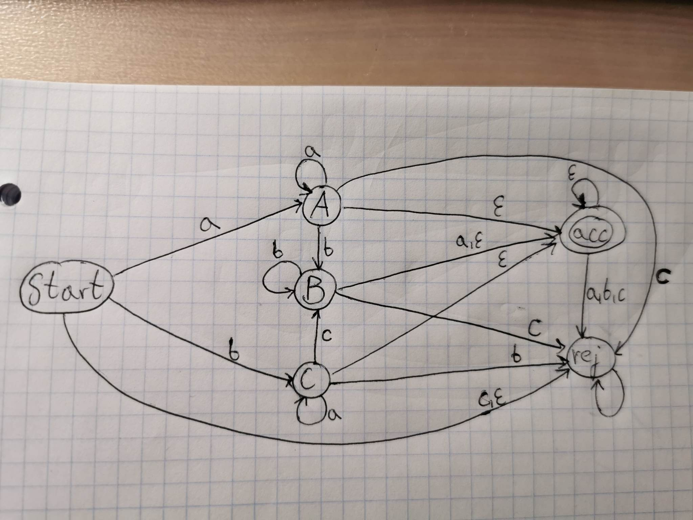

# State Design Pattern
Program validates if an input statement (string) satisfies the gramma:\
G = <	{ a, b, c },\
&emsp;&emsp;&emsp;{ Start, A, B, C },\
&emsp;&emsp;&emsp;{	Start ->	aA | bC,\
&emsp;&emsp;&emsp; A&emsp;&emsp;->	aA | bB | ε,\
&emsp;&emsp;&emsp; B&emsp;&emsp;->	bB | a | ε,\
&emsp;&emsp;&emsp; C&emsp;&emsp;->	cB | aC | ε },\
&emsp;&emsp;&emsp;Start >

### Graph representation:

